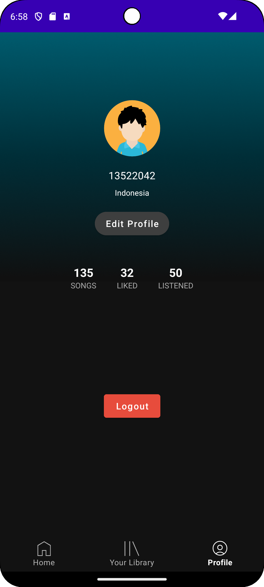

# 👨🏽 Purrytify

Musik adalah bagian tak terpisahkan dari kehidupan. Ia menghubungkan perasaan, menciptakan kenangan, dan memberi warna dalam keseharian kita. Namun, bayangkan jika suatu hari seluruh musik di dunia tiba-tiba menghilang. Itulah malapetaka yang terjadi ketika Dr. Asep Spakbor—lelah dengan serbuan sound horeg yang menghantuinya sepanjang musim panas—menciptakan "Music-Erase-Inator", sebuah alat jahat yang mampu menghapus semua musik dari muka bumi!

Tanpa musik, dunia menjadi sunyi dan hampa. Kehidupan kehilangan ritmenya, kebahagiaan pun memudar. Bahkan di markas O.W.C.A. (Organisasi Warga Cool Abiez), para agen rahasia merasa frustasi. Biasanya, irama musik setia menemani mereka dalam menjalankan misi, namun kini, hanya keheningan yang tersisa. Di tengah krisis ini, Purry menolak untuk menyerah! Bersama timnya, ia bertekad untuk mengembalikan harmoni ke dunia dengan menciptakan Purrytify—sebuah aplikasi revolusioner yang memungkinkan semua orang kembali menikmati musik favorit mereka.

Namun, Purrytify bukan sekadar aplikasi streaming biasa. Ini adalah simbol perlawanan terhadap tirani anti-musik Dr. Asep Spakbor! Dengan fitur canggih dan koleksi lagu yang luas, aplikasi ini menjadi senjata utama dalam pertempuran untuk mengembalikan kebahagiaan dunia melalui alunan nada.

Kini, misi besar dimulai. Mampukah kamu, sebagai agen rahasia O.W.C.A., membantu Purry dan timnya menghadapi rintangan, menumbangkan rencana jahat Dr. Asep Spakbor, dan mengembalikan musik ke dunia?

## ⚡ Main Features

| Feature      | Screenshot                                                     |
| ------------ | -------------------------------------------------------------- |
| Loading      |  |
| Login        |      |
| Home         |        |
| Your Library |  |
| Profile      |  |

## 🕹️ Library

-

## 💻 Developers

| Name                                                                 | Features                      | Exploration hours | Working Hours |
| -------------------------------------------------------------------- | ----------------------------- | ----------------- | ------------- |
| [Ibrahim Ihsan Rasyid - 13522018](https://github.com/ibrahim-rasyid) |                               |                   |               |
| [Amalia Putri - 13522042](https://github.com/amaliap21)              | Loading, Login, Home, Profile | 5                 | 20            |
| [Muhammad Syarafi Akmal - 13522076](https://github.com/SyarafiAkmal) |                               |                   |               |
